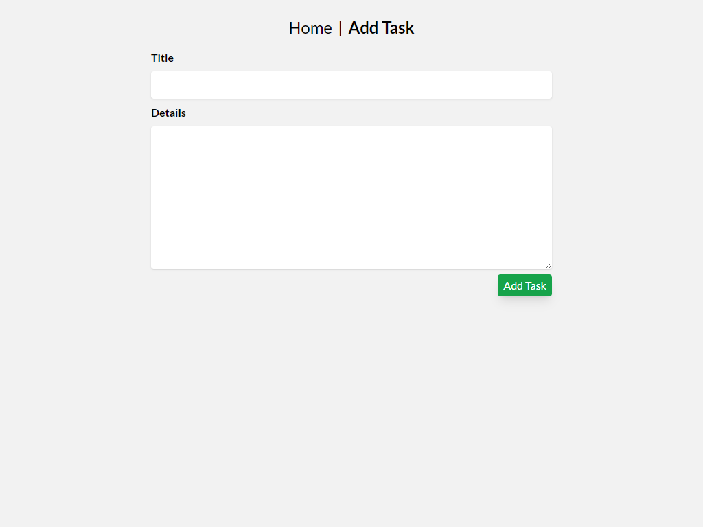

# Overview

CRUD App made with ReactJs as an Test Assignment for BonApp. The test and brief was given in Sunday, 13 Feb 2022 and should be finished before 15 Feb 2022.

### How to test

Install the node_modules first

`npm install`

You need to run React Development (port:3000) and json-erver (port:5000) at the same time

`npm start` && `json-server --watch db.json --port 5000`

or since im using 'concurrently' you can run both at the same time with

`npm run dev`

## Screenshoot

### Home

### Add Page

## My Process

### Built with

- ReactJs
- TailwindCss
- Redux
- React Router
- json-server
